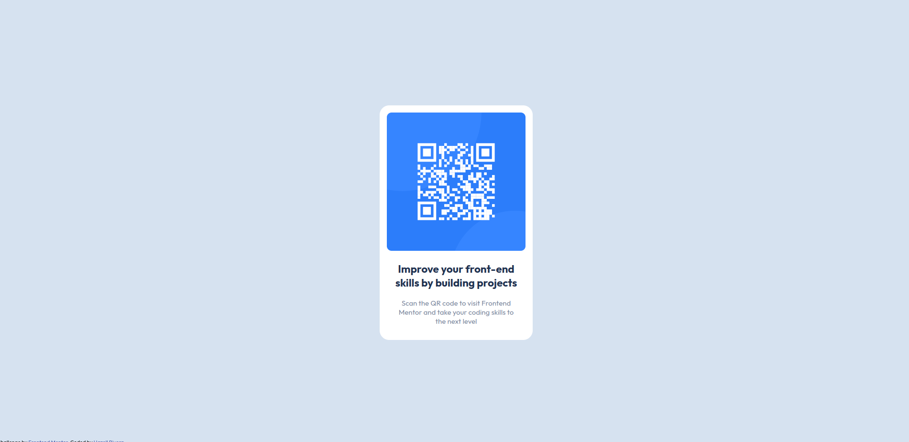

# Frontend Mentor - QR code component solution

This is a solution to the [QR code component challenge on Frontend Mentor](https://www.frontendmentor.io/challenges/qr-code-component-iux_sIO_H). Frontend Mentor challenges help you improve your coding skills by building realistic projects. 

## Table of contents

- [Overview](#overview)
  - [Screenshot](#screenshot)
  - [Links](#links)
- [My process](#my-process)
  - [Built with](#built-with)
  - [What I learned](#what-i-learned)
  - [Continued development](#continued-development)
  - [Useful resources](#useful-resources)
- [Author](#author)
- [Acknowledgments](#acknowledgments)

**Note: Delete this note and update the table of contents based on what sections you keep.**

## Overview

### Screenshot


### Links

- Solution URL: [GitHub](https://github.com/RiveraHan/qr-css-flex)
- Live Site URL: [Netlify](https://qr-htmlcss.netlify.app/)

## My process

### Built with

- Semantic HTML5 markup
- CSS custom properties
- Flexbox

### What I learned

In this lesson I was able to learn about the use of flex box when making my styles I realized that I can center vertically and horizontally with the advantage that flex box offers me when declaring my flexible components

To see how you can add code snippets, see below:

```html
<div class="container">
    <div class="card">
      <div class="card-header">
        
      </div>
      <div class="card-body">
        <h2>Improve your front-end skills by building projects</h2>
        <p>Scan the QR code to visit Frontend Mentor and take your coding skills to the next level</p>
      </div>
    </div>
  </div>
```
```css
.container {
    display: flex;
    justify-content: center;
    align-items: center;
    height: 100vh;
}

.card {
    background-color:hsl(0, 0%, 100%);
    width: 320px;
    padding: 15px 15px;
    border-radius: 20px; 

}

.card-header img {
    width: 100%;
    border-radius: 10px;
}

.card-body {
    display: flex;
    flex-direction: column;
    padding: 0 15px;
}
```

### Continued development

I would like to improve the box concept and how should I apply it to my styles, either with felt box or in a future grid

### Useful resources

[CSS Flex Box and Grid](https://www.freecodecamp.org/espanol/news/como-centrar-cualquier-cosa-en-css-usando-flexb)

## Author

- Website - [Add your name here](https://www.your-site.com)
- Frontend Mentor - [@RiveraHan](https://www.frontendmentor.io/profile/RiveraHan)
- Twitter - [@rivera_hanzell](https://twitter.com/rivera_hanzell)

## Acknowledgments

I relied on a solution from [Eyüp Uçmaz](https://codepen.io/eyupucmaz), he helped me understand how I can group the elements and give it a custom style
